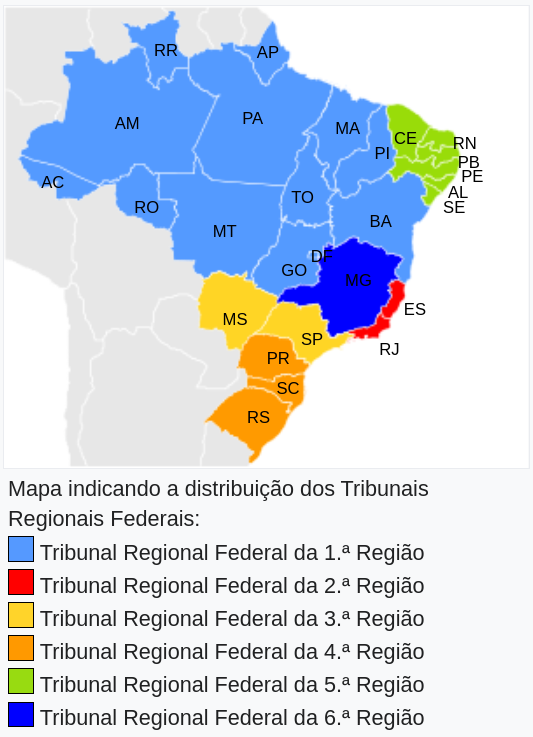
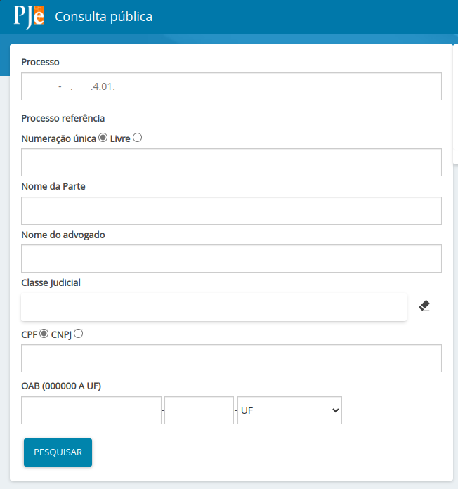
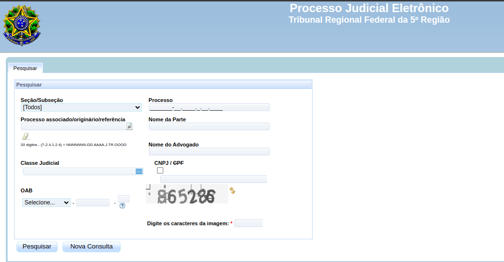
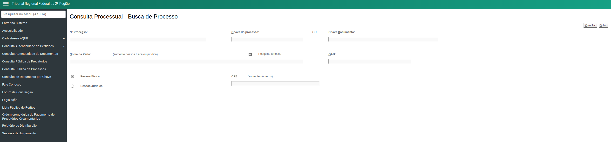
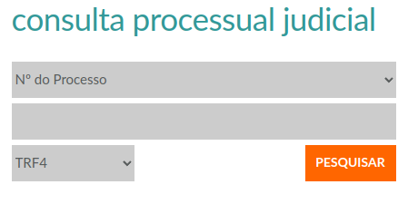

# Web Scraper de Processos

O projeto é uma aplicação web dedicada à busca e extração de informações de processos judiciais nos tribunais regionais federais (TRF-1, TRF-2, TRF-3, TRF-4, TRF-5, TRF-6), no Conselho Nacional de Justiça (CNJ) e no Supremo Tribunal Federal (STF).

Desenvolvida com o framework [FastAPI](https://fastapi.tiangolo.com/) para gerenciar as solicitações HTTP e a biblioteca [Selenium](https://www.selenium.dev/) para automatizar a interação com os sites, a aplicação oferece uma solução abrangente para profissionais do direito, pesquisadores e outros usuários interessados em acessar informações judiciais relevantes.

Por meio da interface web, os usuários podem fornecer critérios de busca, como nome das partes envolvidas ou cpf, e a aplicação executa a busca nos sites dos tribunais pertinentes. Utilizando o WebDriver do Selenium, a aplicação navega pelos sites, extrai os dados dos processos e os apresenta em um formato estruturado e de fácil interpretação.

Com sua abordagem automatizada, a aplicação reduz significativamente o tempo e esforço necessários para acessar informações jurídicas relevantes, proporcionando uma experiência eficiente e intuitiva aos usuários.

## Pesquisa de processos nos TRFs

### [PJe - Processo Judicial eletrônico](https://www.pje.jus.br/navegador/)

O PJe é uma plataforma digital que oferece uma abordagem padronizada e gratuita para a prática de atos jurídicos e acompanhamento de processos judiciais. Seu objetivo é proporcionar eficiência e economia de recursos, substituindo soluções individuais por uma solução unificada.

A pesquisa no PJe pode ser filtrada pelo número do processo, nome da parte, nome do advogado, classe judicial, cpf, cnpj ou número da OAB.

<figure>

<figcaption>Interface para consulta do TRF-1, TRF-3, TRF-6</figcaption>
</figure>

<figure>

<figcaption>Interface para consulta do TRF-5</figcaption>
</figure>

Os seguintes TRFs têm processos disponíveis no PJe para consulta:
- [TRF-1](https://pje1g.trf1.jus.br/consultapublica/ConsultaPublica/listView.seam)
- [TRF-3](https://pje1g.trf3.jus.br/pje/ConsultaPublica/listView.seam)
- [TRF-5](https://pje.trf5.jus.br/pje/ConsultaPublica/listView.seam)
- [TRF-6](https://pje1g.trf6.jus.br/consultapublica/ConsultaPublica/listView.seam)

### Eproc

O eproc é um sistema completo de tramitação, movimentação e controle de processos de primeiro e segundo graus de jurisdição.

No Eproc é possível realizar consulta pública de processos no:

- [TRF-2](https://eproc.trf2.jus.br/eproc/externo_controlador.php?acao=processo_consulta_publica)
- [TRF-4](https://www.trf4.jus.br/trf4/controlador.php?acao=principal&)

<figure>

<figcaption>Interface para consulta do TRF-2</figcaption>
</figure>

<figure>

<figcaption>Interface para consulta do TRF-4</figcaption>
</figure>

## Pesquisa processual CNJ

A consulta processual do CNJ pelo PJE é uma ferramenta digital que permite acompanhar o andamento de processos judiciais de forma ágil e transparente. Através do PJE, advogados, partes e cidadãos podem acessar informações sobre seus casos, como despachos, decisões e prazos, promovendo maior transparência no sistema judicial brasileiro e fortalecendo a confiança na justiça.

- [CNJ](https://www.cnj.jus.br/pjecnj/ConsultaPublica/listView.seam)
